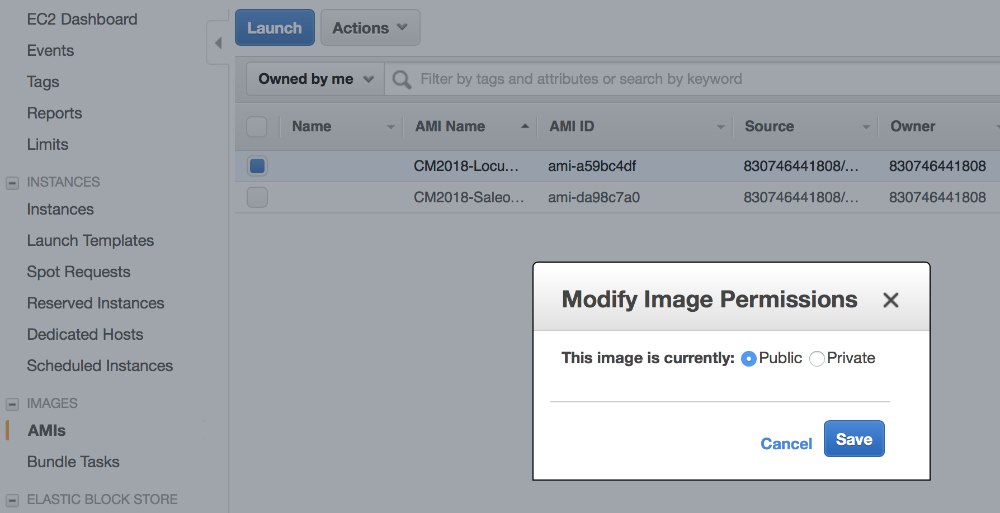

## Notes on building AMIs for the Locust CodeMash PreCompiler Workshop

**NOTE:** the images created must be of instances running in that AWS Region

**NOTE:** it takes several minutes for an AMI ID to propagate and be found by others once it is made public

1. Launch 2 **m5.large** Ubuntu 16.04 (LTS) 64-bit instances.  Add **Name** Tags to both, naming one **Saleor** and the other **Locust**
2. When the instances are up and running, update your Ansible **inventory.ini** file with the Public DNS hostnames.  Add them to your **~/.ssh/config** as well to allow login with the appropriate EC2 private key identity file.
3. Run Ansible Playbook:
    `ansible-playbook site.yml`
4. **For Saleor** When `ansible-playbook` completes use the **EC2 Dashboard** to **Create an Image**
 
5. Enter the Image Name and Image Description for Saleor
 
6. Click **Create Image**
7. You can view the pending image under **Images**
 
8. When the image is complete ("available"), you can make it public:
 
 
8. Repeat these steps for the **Locust** Image, substituting **Locust** for **Saleor** where appropriate.

