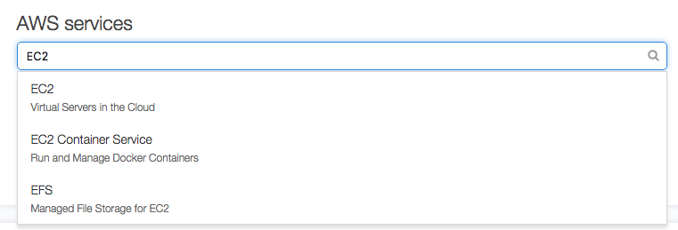
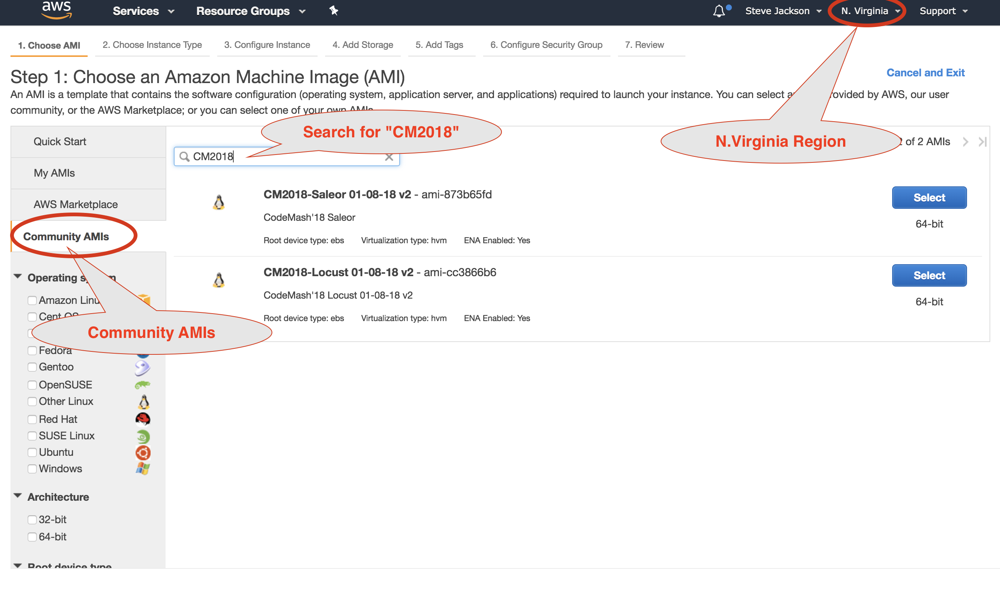
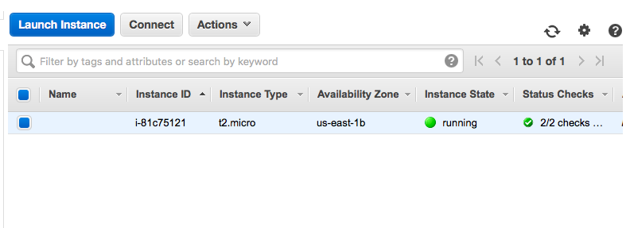

# Getting Started with AWS and EC2

## Sign up for AWS free account

1. Navigate to [http://aws.amazon.com](http://aws.amazon.com) and sign up for a new account. (Note: you will need a payment method and active phone number to complete registration)
2. When registration is completed and you are signed in, navigate to [https://console.aws.amazon.com](https://console.aws.amazon.com).


## Provision an EC2 Instance

1. Navigate to [https://console.aws.amazon.com](https://console.aws.amazon.com).
1. Use the search field under "AWS Services" to search for EC2 
<br/>
2. Click on **EC2**.
<br/>
3. Click on **Launch Instance**.
<br/>
4. Find the AMI for **Ubuntu Server 16.04LTS (HVM), SSD Volume Type** - ami-7c803d1c. Click **Select**.
<br/>
5. Choose an instance type of **m5.large** and click **Review and Launch**.
<br/>
5. Select **Edit Security Group**
<br/>
5. Configure a new security group named **codemash18** with inbound rules like the image below (ports 22 for SSH, 80 for HTTP, 8000 for the Django Development server, and 8089 for the Locust Webserver):
<br/>
<br/> and click **Review and Launch**
5. Scroll to the bottom of page and select **Edit Tags**
<br/>
5. Add a tag **Name** with a value of **saleor** (this will help keep track of which instance is which later on - our System Under Test (saleor) or our load generating system (locust).
<br/>
<br/> and click **Review and Launch**
5. Now click **Launch**!
6. You'll be asked for a key pair. Select **Create a new key pair**, give it a name **codemash18**, and click **Download Key Pair**.
<br/>
7. This will create a key and download the private key on your local machine.
8. If the file saves to your computer with a **.txt** file extention, rename it to have a **.pem** extension.
9. On OS X and Linux, restrict permissions on the key. ssh will require this later:

    ```
    host$ chmod 400 <path_to_your_pem_file>
    ```

10. Click **Launch Instance**.

### Key Management
Anyone who has the private key you just downloaded can log into your EC2 instance. The first thing you should do is place it somewhere meaningful on your computer where you will remember where and what it is. Your *Downloads* folder is not an appropriate place for long-term key storage. 

### Set Up Billing Alerts

We recommend you go to [https://console.aws.amazon.com/billing/](https://console.aws.amazon.com/billing/) and configure **billing alerts** that will let you know if you start getting charges on your account. If you make a mistake or start getting unexpected traffic you'll be able to react quickly and avoid getting any surprising charges.

## Log into EC2 Remotely with SSH

1. Open EC2 Dashboard at [https://console.aws.amazon.com/ec2/](https://console.aws.amazon.com/ec2/). Click on **Instances**.
<br/>
2. Select your newly created instance and click **Connect**. (If your instance doesn't appear, you may be in the wrong region. Try the other US regions in the upper-right drop-down.)
<br/>
3. Follow the provided instructions for connecting to your instance via SSH. In an OSX or Linux system, you can run:

    ```
    host$ ssh -i "<path to private key>" <ec2_user>@<ec2_public_ip>
    ```

    > Note: The "ec2_user" for Ubuntu Server on AWS is ```ubuntu```.
4. You should have a login
