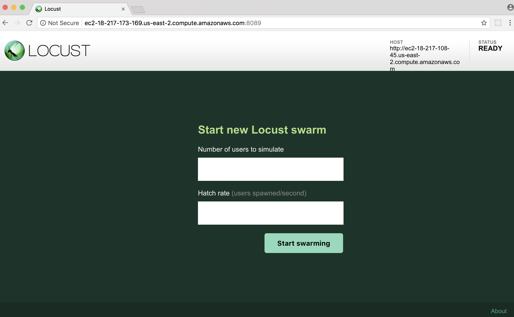
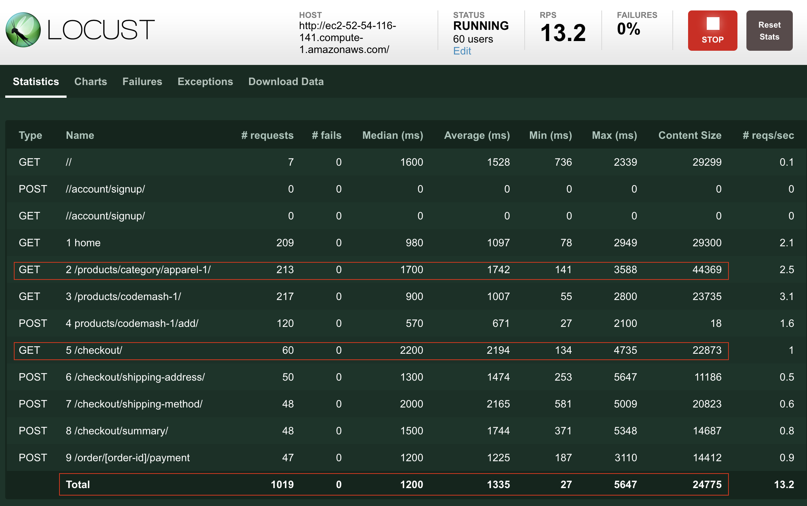
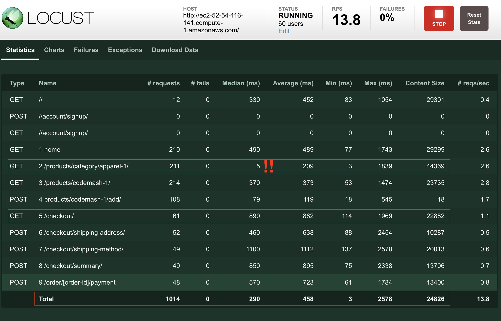
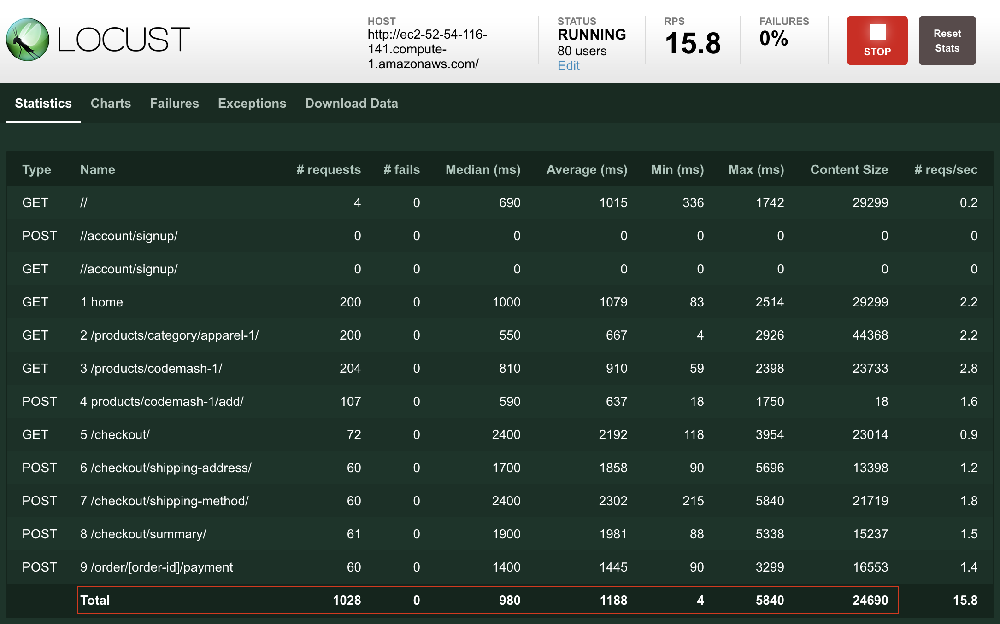

Eliminate Per-Page Bottleneck
-----------------------------

## Objective
Modify saleor to cache our slowest static views so they can be re-used between users

## Prerequisites
* Saleor running and accessible via web browser
* Locust installed on ec2 node
* SSH to locust machine
* SSH to saleor machine

## Getting Started

### Open browser to Saleor instance
1. Go into the ec2 web view and copy the `Public DNS` value

1. Open a browser to that URL `http://<Saleor DNS>` (Chrome will be used below):


### Update locustfile.py
1. Next, use a console to SSH into your locust machine.

1. On the locust machine, update git so that we're at a good starting point.

    ```bash
    ubuntu@locust:~$ cd ~/loadtest
    ubuntu@locust:~/loadtest$ git fetch origin
    ubuntu@locust:~/loadtest$ git reset --hard origin/find_baseline
    ```

### Start locust
1. Start locust:

    ```bash
    ubuntu@locust:~/loadtest$ locust --host http://<Saleor DNS>
    ```
    It should look something like this:

    ```bash
    ubuntu@locust:~/loadtest$ locust --host http://ec2-18-217-108-45.us-east-2.compute.amazonaws.com
    [2017-12-24 02:58:54,522] ip-172-31-43-238/INFO/locust.main: Starting web monitor at *:8089
    [2017-12-24 02:58:54,522] ip-172-31-43-238/INFO/locust.main: Starting Locust 0.8
    ```

1. Now we need the Public DNS for the Load Test machine:


1. Open a browser to `http://<LoadTest DNS>:8089`


## Find Slow Views
1. Based on previous test runs you should have a good idea how many users will cause the site to suffer.  In this example we'll use 60 with a hatch rate of 5.

1. Let the test run for a bit until the numbers start to stabilize.  This run was for 1000 requests.


1. From this we see that `/products/category/apparel-1` is our worst offender.  It's hit 3x as often as most of the other routes and has a high median response time.  `/checkout` is also quite slow.  Let's start with those two.

## Add template caching to Django views

1. On the saleor machine navigate to the django source code. 

    ```bash
    ubuntu@saleor:~$ cd ~/saleor
    ```
    
1. First we'll fix the Apparel page.  We'll tell django to cache this page for 15 seconds.

    1. Edit `saleor/products/url.py`

    1. Insert into line 2:
    
        ```python
        from django.views.decorators.cache import cache_page
        ```

    1. Change line 11:

        Replace:
        
        ```python
                views.category_index, name='category'),
        ```
        
        With:
        
        ```python
                cache_page(15)(views.category_index), name='category'),
        ```
1. Next we'll address the first Checkout page.

    1. Edit `saleor/checkout/urls.py`
    
    1. Insert into line 2:

        ```python
        from django.views.decorators.cache import cache_page
        ```

    1. Change line 8:

        Replace:
        
        ```python
            url(r'^$', views.index_view, name='index'),
        ```
        
        With:
        
        ```python
            url(r'^$', cache_page(15)(views.index_view), name='index'),
        ```

1.  Now we have to restart django.  Django is running inside of uwsgi, so we'll restart that.
 
    ```bash
    sudo supervisorctl restart uwsgi
    ```

## Establish a new baseline

Back at the locust web UI we can start a new run.  Using the same 60 users as before we see a significant improvement in the two pages we've added caching to.



And we can support 33% more users at the old performance levels:




## Conclusion

Caching can help in a number of situations when the data doesn't change much from request to request.  Unfortunately, that doesn't cover all of our cases.  Additionally knowing when a cached value should be thrown away is an infamously difficult problem.

